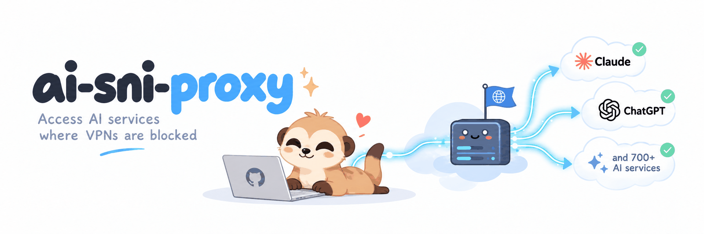
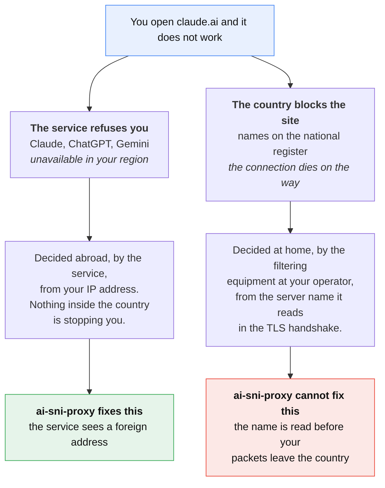
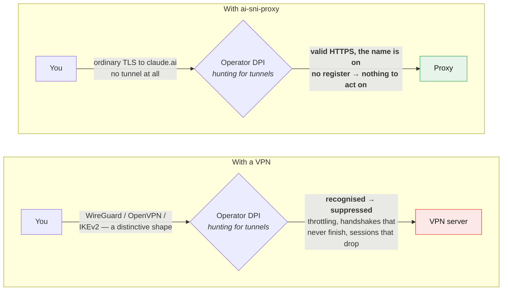
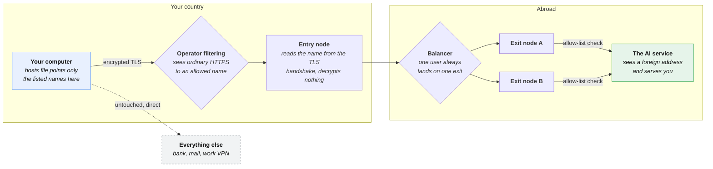
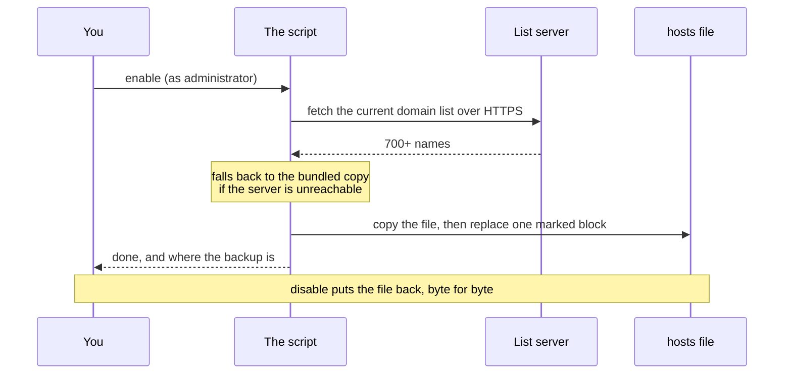

<p align="center">
  
</p>

> 🇷🇺 **Читаете по-русски?** [Основная версия этой страницы →](README.md)

# ai-sni-proxy

[](https://github.com/SteepMans/ai-sni-proxy/stargazers)
[](LICENSE)
[](#install)

**If this saved you an afternoon, leave a ⭐ — it is the only metric this project has.**

Reach Claude, ChatGPT, Gemini, JetBrains AI and 700+ related hostnames from a
country those services refuse to serve. No VPN, no client running in the
background, no browser extension: a script adds one block to your `hosts`
file, and those names alone travel through a proxy abroad.

📖 [Manual setup](docs/manual.en.md) · 🤝 [Contributing](CONTRIBUTING.md#contributing) · 🇷🇺 [По-русски](README.md)

---

## Where the block actually is

Two very different things get called "blocked", and mixing them up is why
people reach for a VPN when they do not need one.



**The AI services are the first case.** Claude, ChatGPT and Gemini are not on
any national register — nothing inside Russia stops the connection. The
refusal comes from the other end, after the service looks at where you are
connecting from. Give it a different address and it serves you normally.

### So why not just use a VPN?

Because filtering in Russia is aimed at VPNs specifically, and it works. With
ordinary HTTPS there is nothing for it to aim at.



The filtering equipment at Russian operators identifies VPNs by the shape of
their traffic — WireGuard, OpenVPN and IKEv2 each have a characteristic one —
and suppresses them on purpose: throttling, handshakes that never complete,
sessions that die after a minute. What follows is a cat-and-mouse game of
obfuscation, TLS camouflage and port hopping, where every filter update breaks
what worked yesterday.

There is no such game here. What leaves your machine is an ordinary TLS
connection to `claude.ai` — to the filter, valid HTTPS to a name that is on no
register. Nothing to recognise, nothing to block, nothing to act on.

A VPN's routing can of course be configured to send only selected addresses
through the tunnel; that part is fixable. What is not fixable is that the
tunnel itself is exactly what the filter is looking for.

---

## What happens to your traffic



Nothing decrypts your traffic. The proxy reads only the server name that TLS
sends in the clear during the handshake (the SNI field), checks it against the
allow-list, and forwards the bytes untouched. It cannot read your messages,
your API keys or your account — the connection stays end-to-end between you
and the service, exactly as it would without the proxy.

### What happens when you run `enable`



The list lives on the server, not inside the client, so a hostname added today
reaches you on your next run — no re-download, no update mechanism to trust.

---

## Install

Download a [prebuilt archive](https://github.com/SteepMans/ai-sni-proxy/releases/latest)
or the repository itself (`git clone`), open the folder for your system and run
the file.

### Windows

Open the `windows` folder and double-click **`enable.bat`**. It asks for
administrator rights itself — Windows will show the usual prompt.

```
windows\enable.bat     turn it on
windows\disable.bat    turn it off
windows\status.bat     see what is in place (no rights needed)
```

### macOS

Open the `macos` folder and double-click **`enable.command`**. Terminal opens
and asks for your login password, because editing `/etc/hosts` needs it.

If macOS refuses with *"cannot be opened because it is from an unidentified
developer"*, clear the quarantine flag once and try again:

```sh
cd macos
xattr -d com.apple.quarantine *.command
chmod +x *.command
```

### Linux

```sh
cd linux
chmod +x *.sh ../bin/ai-sni-proxy.sh
./enable.sh          # asks for sudo
./disable.sh
./status.sh
```

Or call the script directly, which is the same thing:

```sh
sudo ./bin/ai-sni-proxy.sh enable
```

### One thing browsers do that breaks this

Chrome, Edge, Firefox and Yandex Browser can resolve names through their own
encrypted DNS, which ignores the `hosts` file completely. If `ping claude.ai`
shows the proxy address but the browser still shows the region error, turn off
**Secure DNS / DNS over HTTPS** in the browser settings and restart it.

---

## What we can see

Honesty matters more than a marketing line, so: traffic for the listed names
passes through servers run by the author. From that position the proxy records
the service name from the handshake, your IP address, byte counts and the
duration of each connection — the same metadata your internet provider already
has. It cannot record content: the TLS session is between your machine and the
service, and the proxy never holds the keys.

If that trade is not for you, run your own exit node: the whole
configuration, tested and commented, is below in
[Run your own server](#run-your-own-server). The client does not care where it
points.

---

## Run your own server

If you would rather not send your traffic through someone else's proxy, run
your own. It is forty lines of configuration and five minutes of work: the
server decrypts nothing, so it needs neither a certificate nor a domain name.

You will need a VPS abroad with port 443 free. Everything below has been
tested on a live machine.

**1. The nginx configuration** — `/opt/ai-sni-proxy/nginx.conf`:

```nginx
# ai-sni-proxy: minimal self-hosted server.
# Routes TLS by the server name from the handshake without decrypting anything.

events {}

stream {
    # Seven hundred names do not fit the default hash table, and nginx refuses
    # to start rather than silently truncating the list.
    map_hash_bucket_size 128;
    map_hash_max_size 4096;

    log_format sni '$remote_addr $ssl_preread_server_name $status $bytes_sent';
    access_log /var/log/nginx/sni.log sni;

    # Allowed names, generated from the domain list (see below).
    map $ssl_preread_server_name $allowed {
        hostnames;
        default 0;
        include /etc/nginx/allowed.map;
    }

    # Anything not on the list goes to the discard port, where nothing listens,
    # so the connection dies immediately. Do not remove this line: without it
    # you are running an open relay, and it will be found within days.
    map $allowed $backend {
        1       "$ssl_preread_server_name:443";
        default "127.0.0.1:9";
    }

    # proxy_pass with a variable in it resolves the name at connection time,
    # and for that nginx needs a resolver of its own - it does not read
    # /etc/resolv.conf here. Without this line every connection ends in 500.
    # ipv6=off on purpose: if the server has no working IPv6 route, an AAAA
    # answer turns every connection into a timeout.
    resolver 1.1.1.1 8.8.8.8 valid=300s ipv6=off;
    resolver_timeout 5s;

    limit_conn_zone $binary_remote_addr zone=perip:10m;

    server {
        listen 443;
        ssl_preread on;
        proxy_pass $backend;
        proxy_timeout 5m;
        limit_conn perip 200;
    }
}
```

**2. The allow-list** — without it the server lets nobody anywhere:

```sh
curl -fsSL https://chimney.steep-man.ru/ai-sni-proxy/domains.txt   | grep -v '^#' | grep . | sed 's/$/ 1;/' > /opt/ai-sni-proxy/allowed.map
```

Bring your own list if you prefer — the format is one `name 1;` per line.

**3. Start it:**

```sh
docker run -d --name ai-sni-proxy --restart unless-stopped --network host   -v /opt/ai-sni-proxy/nginx.conf:/etc/nginx/nginx.conf:ro   -v /opt/ai-sni-proxy/allowed.map:/etc/nginx/allowed.map:ro   nginx:1.27-alpine
```

A system nginx built with the `stream` module works just as well (on Debian
and Ubuntu that is the `libnginx-mod-stream` package).

**4. Check it** from any machine, with your server's address:

```sh
curl -sI --resolve claude.ai:443:203.0.113.10 https://claude.ai | head -1
curl -sI --resolve example.com:443:203.0.113.10 https://example.com | head -1
```

The first should return the service's answer, the second should be cut off.
If both are cut off, read `docker logs ai-sni-proxy`.

**5. Point the client at it:**

```sh
sudo AI_SNI_PROXY_ENTRY=203.0.113.10 ./bin/ai-sni-proxy.sh enable
```

```powershell
.ini-sni-proxy.ps1 enable -Entry 203.0.113.10
```

### What not to do

**Do not remove the `127.0.0.1:9` line.** It sends everything that is not on
the list to a port where nothing listens. Without it you are running an open
relay: anyone can reach anything through your server under your name, and it
will be found within days — the internet is scanned continuously.

**Do not let the list go stale.** Services add new domains, and one day half
of them stop working. Once a day is enough:

```sh
0 5 * * * curl -fsSL https://chimney.steep-man.ru/ai-sni-proxy/domains.txt | grep -v '^#' | grep . | sed 's/$/ 1;/' > /opt/ai-sni-proxy/allowed.map && docker exec ai-sni-proxy nginx -s reload
```

**Do not put the server in the country you are connecting from.** The whole
point is for the service to see a foreign address; from the data centre next
door it sees your own region.

---

## The domain list

| | |
|---|---|
| Published at | `https://chimney.steep-man.ru/ai-sni-proxy/domains.txt` |
| Groups | AI services, JetBrains |
| Names | 700+ |
| Offline copy | [`domains/fallback.txt`](domains/fallback.txt) |

Every run downloads the current list; the bundled copy is used only when the
server cannot be reached. A list shorter than 20 names is rejected as damaged
rather than written to a system file.

**Missing a service?** Open an issue with the hostnames — the server list is
updated from here, and everyone gets them on their next run. To add names for
yourself alone, append them to `domains/fallback.txt` and run with
`AI_SNI_PROXY_LIST_URL=` (empty) so the local copy wins.

---

## Safety of the change itself

The script is careful with the file it edits, because it is not ours:

- a timestamped copy is made before every change — `hosts.bak-ai-sni-proxy-*`;
- only the text between the two marker lines is replaced, never anything else;
- if the marker block is damaged (a begin without an end), the script stops and
  changes nothing;
- the new file is written next to the original and swapped in one move, so an
  interrupted run cannot leave you without a `hosts` file;
- `disable` restores the file byte for byte.

Prefer to do it by hand, or want to know exactly what the script writes? The
[manual setup guide](docs/manual.en.md) shows the same change step by step.

---

## Settings

| Variable | Default | What it is |
|---|---|---|
| `AI_SNI_PROXY_ENTRY` | `84.38.189.217` | Address the names point at |
| `AI_SNI_PROXY_LIST_URL` | the URL above | Where the list comes from |
| `AI_SNI_PROXY_HOSTS` | system `hosts` | File to edit — handy for a dry run |

On Windows the same three exist as parameters: `-Entry`, `-ListUrl`, `-HostsPath`.

---

## Support the project

The exit nodes are rented servers and the traffic is paid for month by month.
If this is useful to you, a coffee's worth helps keep them running:

| Coin | Address |
|---|---|
| BTC | `bc1qfkqmazqmg44uzk286j93f84dzecdarsf7nwxrj` |
| ETH / USDT (ERC-20) | `0xB193C1A2067a911C8df9dB7883C0a2993Ec2c05A` |
| TRX / USDT (TRC-20) | `TSeaXnbc8XVWdXg1RDCEVpqLUvsEakTcnz` |
| USDT (TON) | `UQCWcoMOvwc_2Q9c3bbLHWJA_PJoJK4xzRwK0mvYurGwHC7u` |

A ⭐ on the repository costs nothing and helps just as much.

---

## License

[MIT](LICENSE). Use it, fork it, run your own. No warranty: you are editing a
system file on your own machine and sending your traffic through someone
else's server, and you should be comfortable with both.
