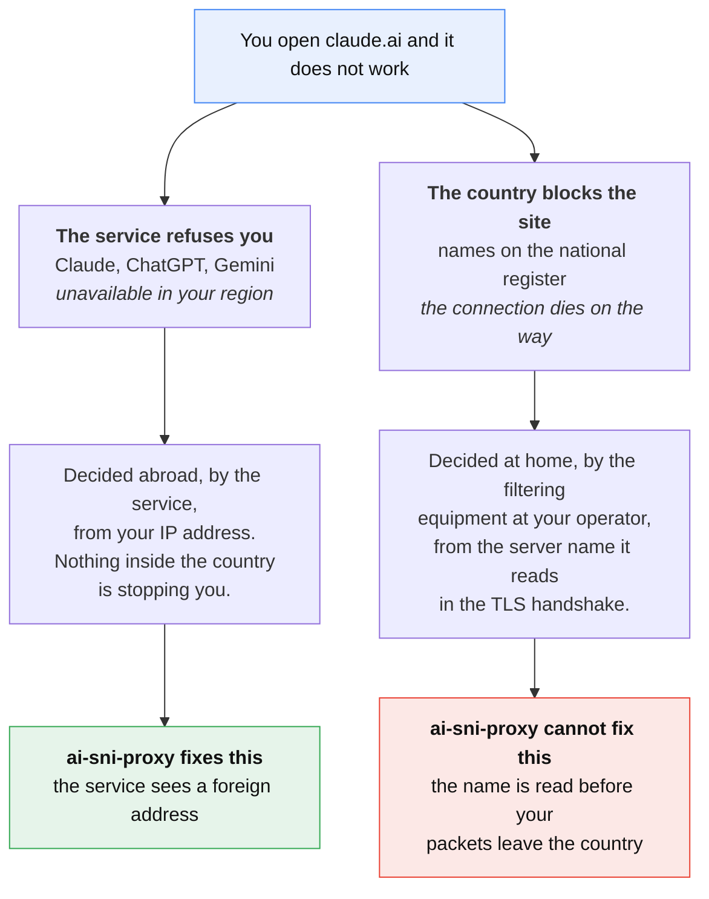
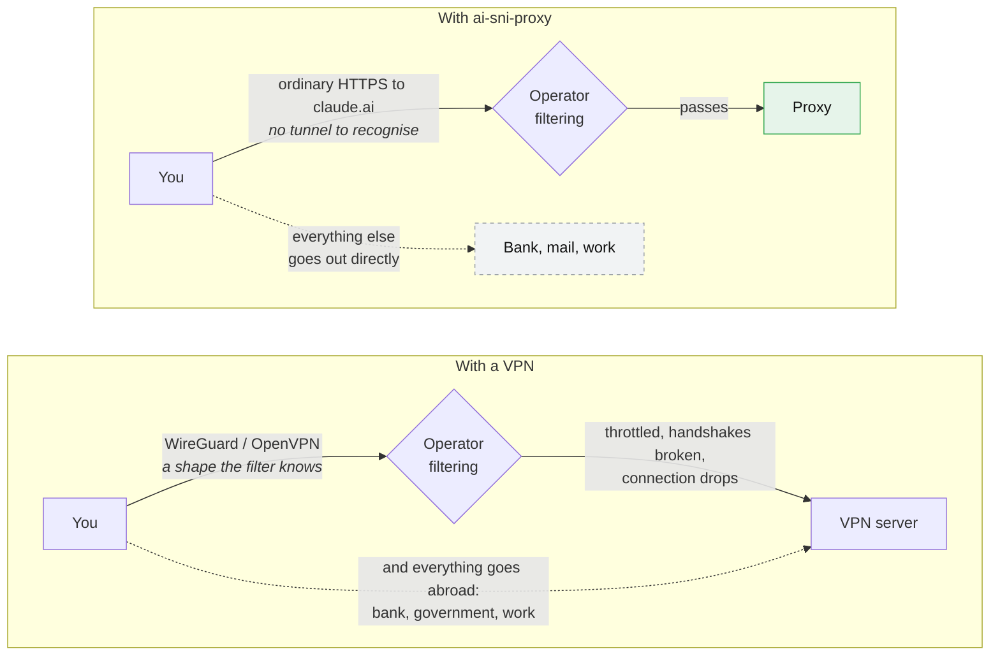
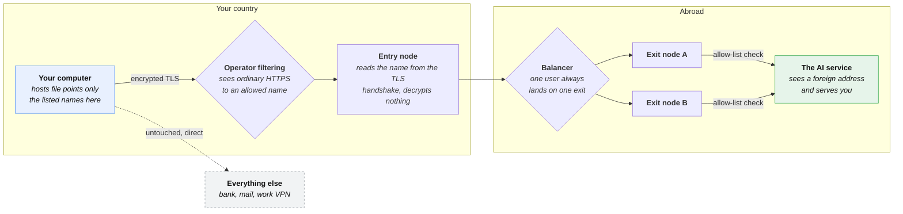
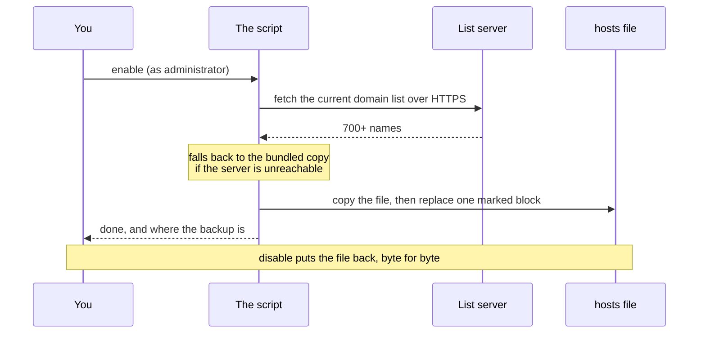

> 🇷🇺 **Читаете по-русски?** [Основная версия этой страницы →](README.md)

# ai-sni-proxy

[](https://github.com/SteepMans/ai-sni-proxy/stargazers)
[](LICENSE)
[](#install)

**If this saved you an afternoon, leave a ⭐ — it is the only metric this project has.**

Reach Claude, ChatGPT, Gemini, JetBrains AI and 700+ related hostnames from a
country those services refuse to serve. No VPN, no client running in the
background, no browser extension: a script adds one block to your `hosts`
file, and those names alone travel through a proxy abroad.

> **About the name.** SNI is the server name that TLS sends in the clear in the
> very first packet of a connection. That is what the proxy routes on, without
> decrypting anything. There is no DNS server involved at all: on your side only
> the `hosts` file is touched.

📖 [Manual setup](docs/manual.en.md) · 🇷🇺 [По-русски](README.md)

---

## Where the block actually is

Two very different things get called "blocked", and mixing them up is why
people reach for a VPN when they do not need one.



**The AI services are the first case.** Claude, ChatGPT and Gemini are not on
any national register — nothing inside Russia stops the connection. The
refusal comes from the other end, after the service looks at where you are
connecting from. Give it a different address and it serves you normally.

### So why not just use a VPN?

Because in Russia a VPN buys you a new problem instead of solving this one.



The filtering equipment installed at every Russian operator (known as ТСПУ) is
built to recognise traffic by its shape, and the common VPN protocols —
WireGuard, OpenVPN, IKEv2 — have a very recognisable one. In practice that
means throttling, handshakes that never finish and sessions that die after a
minute. A VPN also sends **everything** abroad, including the banking and
government sites that refuse foreign addresses in turn: you trade one region
error for another.

This tool sends no VPN protocol at all. What leaves your machine is an
ordinary HTTPS connection to `claude.ai` — indistinguishable from any other
HTTPS connection, because that is exactly what it is. There is no tunnel to
detect, and only the listed names travel that way.

The flip side, worth knowing before you install: for a site that *is* on the
national register, this approach does nothing. The name travels in the clear
inside the very first TLS packet, the filter reads it long before your traffic
reaches the border, and changing where the name resolves does not hide the
name. That needs a tunnel which encrypts the name itself — a VPN or something
like Hysteria, not this.

---

## What happens to your traffic



Nothing decrypts your traffic. The proxy reads only the server name that TLS
sends in the clear during the handshake (the SNI field), checks it against the
allow-list, and forwards the bytes untouched. It cannot read your messages,
your API keys or your account — the connection stays end-to-end between you
and the service, exactly as it would without the proxy.

### What happens when you run `enable`



The list lives on the server, not inside the client, so a hostname added today
reaches you on your next run — no re-download, no update mechanism to trust.

---

## Install

Download a [prebuilt archive](https://github.com/SteepMans/ai-sni-proxy/releases/latest)
or the repository itself (`git clone`), open the folder for your system and run
the file.

### Windows

Open the `windows` folder and double-click **`enable.bat`**. It asks for
administrator rights itself — Windows will show the usual prompt.

```
windows\enable.bat     turn it on
windows\disable.bat    turn it off
windows\status.bat     see what is in place (no rights needed)
```

### macOS

Open the `macos` folder and double-click **`enable.command`**. Terminal opens
and asks for your login password, because editing `/etc/hosts` needs it.

If macOS refuses with *"cannot be opened because it is from an unidentified
developer"*, clear the quarantine flag once and try again:

```sh
cd macos
xattr -d com.apple.quarantine *.command
chmod +x *.command
```

### Linux

```sh
cd linux
chmod +x *.sh ../bin/ai-sni-proxy.sh
./enable.sh          # asks for sudo
./disable.sh
./status.sh
```

Or call the script directly, which is the same thing:

```sh
sudo ./bin/ai-sni-proxy.sh enable
```

### One thing browsers do that breaks this

Chrome, Edge, Firefox and Yandex Browser can resolve names through their own
encrypted DNS, which ignores the `hosts` file completely. If `ping claude.ai`
shows the proxy address but the browser still shows the region error, turn off
**Secure DNS / DNS over HTTPS** in the browser settings and restart it.

---

## What we can see

Honesty matters more than a marketing line, so: traffic for the listed names
passes through servers run by the author. From that position the proxy records
the service name from the handshake, your IP address, byte counts and the
duration of each connection — the same metadata your internet provider already
has. It cannot record content: the TLS session is between your machine and the
service, and the proxy never holds the keys.

If that trade is not for you, run your own exit node and point the client at it:

```sh
sudo AI_SNI_PROXY_ENTRY=203.0.113.10 ./bin/ai-sni-proxy.sh enable
```

```powershell
.\bin\ai-sni-proxy.ps1 enable -Entry 203.0.113.10
```

Your server needs to answer on port 443, route by SNI without decrypting
(nginx `stream` with `ssl_preread` does this in about thirty lines — the
[manual](docs/manual.en.md) has the config), and hold its own allow-list. The
client does not care how it is built.

---

## The domain list

| | |
|---|---|
| Published at | `https://chimney.steep-man.ru/ai-sni-proxy/domains.txt` |
| Groups | AI services, JetBrains |
| Names | 700+ |
| Offline copy | [`domains/fallback.txt`](domains/fallback.txt) |

Every run downloads the current list; the bundled copy is used only when the
server cannot be reached. A list shorter than 20 names is rejected as damaged
rather than written to a system file.

**Missing a service?** Open an issue with the hostnames — the server list is
updated from here, and everyone gets them on their next run. To add names for
yourself alone, append them to `domains/fallback.txt` and run with
`AI_SNI_PROXY_LIST_URL=` (empty) so the local copy wins.

---

## Safety of the change itself

The script is careful with the file it edits, because it is not ours:

- a timestamped copy is made before every change — `hosts.bak-ai-sni-proxy-*`;
- only the text between the two marker lines is replaced, never anything else;
- if the marker block is damaged (a begin without an end), the script stops and
  changes nothing;
- the new file is written next to the original and swapped in one move, so an
  interrupted run cannot leave you without a `hosts` file;
- `disable` restores the file byte for byte.

Prefer to do it by hand, or want to know exactly what the script writes? The
[manual setup guide](docs/manual.en.md) shows the same change step by step.

---

## Settings

| Variable | Default | What it is |
|---|---|---|
| `AI_SNI_PROXY_ENTRY` | `84.38.189.217` | Address the names point at |
| `AI_SNI_PROXY_LIST_URL` | the URL above | Where the list comes from |
| `AI_SNI_PROXY_HOSTS` | system `hosts` | File to edit — handy for a dry run |

On Windows the same three exist as parameters: `-Entry`, `-ListUrl`, `-HostsPath`.

---

## Support the project

The exit nodes are rented servers and the traffic is paid for month by month.
If this is useful to you, a coffee's worth helps keep them running:

| Coin | Address |
|---|---|
| BTC | `bc1qfkqmazqmg44uzk286j93f84dzecdarsf7nwxrj` |
| ETH / USDT (ERC-20) | `0xB193C1A2067a911C8df9dB7883C0a2993Ec2c05A` |
| TRX / USDT (TRC-20) | `TSeaXnbc8XVWdXg1RDCEVpqLUvsEakTcnz` |
| USDT (TON) | `UQCWcoMOvwc_2Q9c3bbLHWJA_PJoJK4xzRwK0mvYurGwHC7u` |

A ⭐ on the repository costs nothing and helps just as much.

---

## License

[MIT](LICENSE). Use it, fork it, run your own. No warranty: you are editing a
system file on your own machine and sending your traffic through someone
else's server, and you should be comfortable with both.
