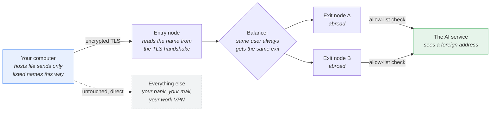
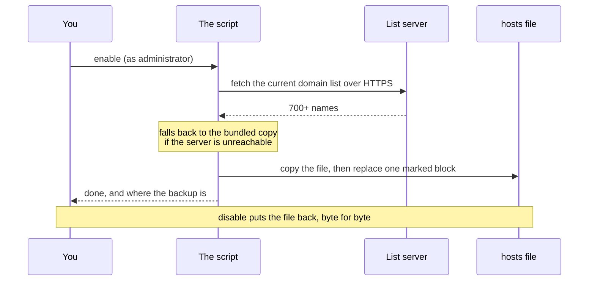

# dns-ai-proxy

[](https://github.com/SteepMans/dns-ai-proxy/stargazers)
[](LICENSE)
[](#install)

**If this saved you an afternoon, leave a ⭐ — it is the only metric this project has.**

Reach Claude, ChatGPT, Gemini, JetBrains AI and 700+ related hostnames from a
country those services refuse to serve. No client software runs in the
background, no system-wide VPN, no browser extension: a script adds one block
to your `hosts` file, and those names alone travel through a proxy abroad.

🇷🇺 [Читать по-русски](README.ru.md) · 📖 [Manual setup](docs/manual.md)

---

## How it works



Nothing decrypts your traffic. The proxy reads only the server name that TLS
sends in the clear during the handshake (the SNI field), checks it against the
allow-list, and forwards the bytes untouched. It cannot read your messages,
your API keys or your account — the same guarantee you get from any TLS
connection, because the connection is still end-to-end between you and the
service.

### What happens when you run `enable`



The list lives on the server, not inside the client, so a hostname added today
reaches you on your next run — no re-download, no update mechanism to trust.

---

## Install

Download the repository ([ZIP](https://github.com/SteepMans/dns-ai-proxy/archive/refs/heads/main.zip)
or `git clone`), open the folder for your system and run the file.

### Windows

Open the `windows` folder and double-click **`enable.bat`**. It asks for
administrator rights itself — Windows will show the usual prompt.

```
windows\enable.bat     turn it on
windows\disable.bat    turn it off
windows\status.bat     see what is in place (no rights needed)
```

### macOS

Open the `macos` folder and double-click **`enable.command`**. Terminal opens
and asks for your login password, because editing `/etc/hosts` needs it.

If macOS refuses with *"cannot be opened because it is from an unidentified
developer"*, clear the quarantine flag once and try again:

```sh
cd macos
xattr -d com.apple.quarantine *.command
chmod +x *.command
```

### Linux

```sh
cd linux
chmod +x *.sh ../bin/dns-ai-proxy.sh
./enable.sh          # asks for sudo
./disable.sh
./status.sh
```

Or call the script directly, which is the same thing:

```sh
sudo ./bin/dns-ai-proxy.sh enable
```

---

## What it does and does not do

**It helps when** a service answers `unavailable in your region`, `country not
supported`, or refuses the sign-up — that is a decision made by the service
based on your IP address, and the proxy gives it a different one.

**It does not help when** the block happens inside your own country. A filter
on the national backbone sees the same server name in the TLS handshake that
our proxy reads, and it sees it first, long before your packets leave the
country. Changing where the name resolves does not hide the name. For that you
need a tunnel that encrypts the name itself — a VPN or something like Hysteria,
not this.

**It is not a VPN.** Only the listed names go through the proxy. Your bank,
your mail, your work VPN and everything else keep going out exactly as before.
That is the point: the blast radius is one block in one file, and `disable`
removes it.

---

## What we can see

Honesty matters more than a marketing line, so: traffic for the listed names
passes through servers run by the author. From that position the proxy records
the service name from the handshake, your IP address, byte counts and the
duration of each connection — the same metadata your internet provider already
has. It cannot record content: the TLS session is between your machine and the
service, and the proxy never holds the keys.

If that trade is not for you, run your own exit node and point the client at it:

```sh
sudo DNS_AI_PROXY_ENTRY=203.0.113.10 ./bin/dns-ai-proxy.sh enable
```

```powershell
.\bin\dns-ai-proxy.ps1 enable -Entry 203.0.113.10
```

Your server needs to answer on port 443, route by SNI without decrypting
(nginx `stream` with `ssl_preread` does this in about thirty lines), and hold
its own allow-list. The client does not care how it is built.

---

## The domain list

| | |
|---|---|
| Published at | `https://chimney.steep-man.ru/dns-ai-proxy/domains.txt` |
| Groups | AI services, JetBrains |
| Names | 700+ |
| Offline copy | [`domains/fallback.txt`](domains/fallback.txt) |

Every run downloads the current list; the bundled copy is used only when the
server cannot be reached. A list shorter than 20 names is rejected as damaged
rather than written to a system file.

**Missing a service?** Open an issue with the hostnames — the server list is
updated from here, and everyone gets them on their next run. To add names for
yourself alone, append them to `domains/fallback.txt` and run with
`DNS_AI_PROXY_LIST_URL=` (empty) so the local copy wins.

---

## Safety of the change itself

The script is careful with the file it edits, because it is not ours:

- a timestamped copy is made before every change — `hosts.bak-dns-ai-proxy-*`;
- only the text between the two marker lines is replaced, never anything else;
- if the marker block is damaged (a begin without an end), the script stops and
  changes nothing;
- the new file is written next to the original and swapped in one move, so an
  interrupted run cannot leave you without a `hosts` file;
- `disable` restores the file byte for byte.

Prefer to do it by hand, or want to know exactly what the script writes? The
[manual setup guide](docs/manual.md) shows the same change step by step.

---

## Settings

| Variable | Default | What it is |
|---|---|---|
| `DNS_AI_PROXY_ENTRY` | `84.38.189.217` | Address the names point at |
| `DNS_AI_PROXY_LIST_URL` | the URL above | Where the list comes from |
| `DNS_AI_PROXY_HOSTS` | system `hosts` | File to edit — handy for a dry run |

On Windows the same three exist as parameters: `-Entry`, `-ListUrl`, `-HostsPath`.

---

## Support the project

The exit nodes are rented servers and the traffic is paid for month by month.
If this is useful to you, a coffee's worth helps keep them running:

| Coin | Address |
|---|---|
| BTC | `bc1qfkqmazqmg44uzk286j93f84dzecdarsf7nwxrj` |
| ETH / USDT (ERC-20) | `0xB193C1A2067a911C8df9dB7883C0a2993Ec2c05A` |
| TRX / USDT (TRC-20) | `TSeaXnbc8XVWdXg1RDCEVpqLUvsEakTcnz` |
| USDT (TON) | `UQCWcoMOvwc_2Q9c3bbLHWJA_PJoJK4xzRwK0mvYurGwHC7u` |

A ⭐ on the repository costs nothing and helps just as much.

---

## License

[MIT](LICENSE). Use it, fork it, run your own. No warranty: you are editing a
system file on your own machine and sending your traffic through someone
else's server, and you should be comfortable with both.
