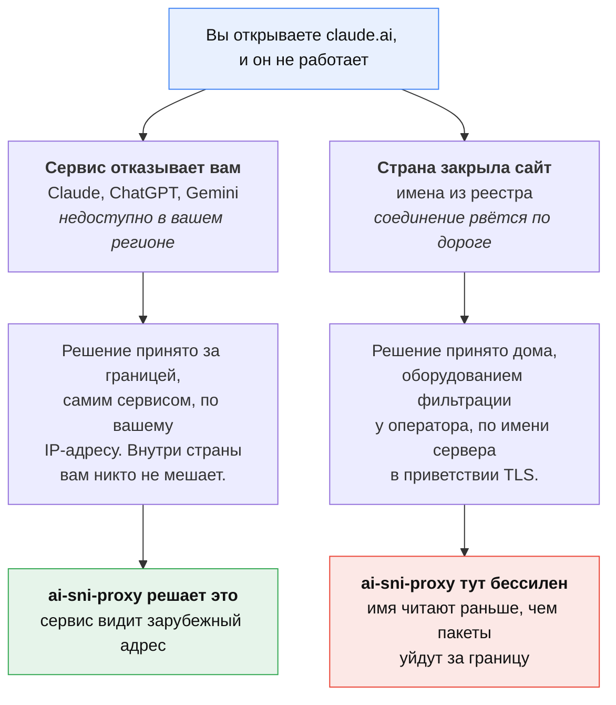
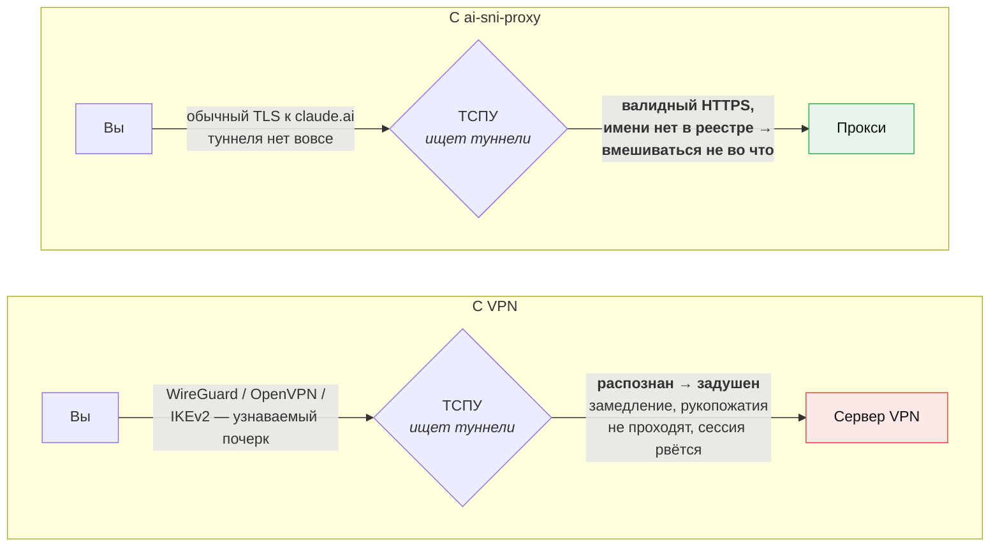
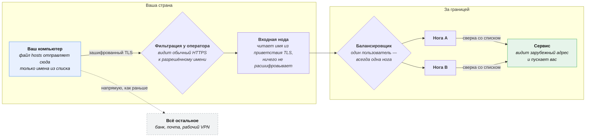
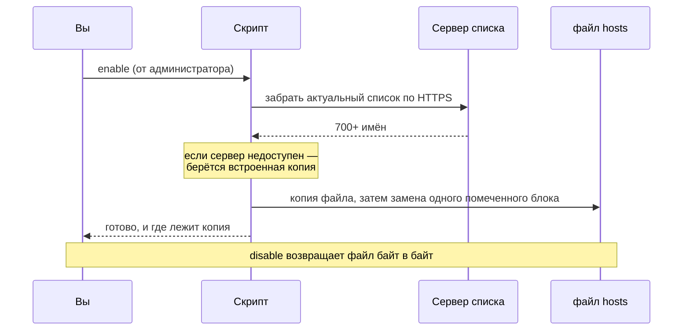

<p align="center">
  
</p>

> 🇬🇧 **English speaker?** [Read this page in English →](README.en.md)

# ai-sni-proxy

[](https://github.com/SteepMans/ai-sni-proxy/stargazers)
[](LICENSE)
[](#установка)

**Если это сэкономило вам вечер — поставьте ⭐, других метрик у проекта нет.**

Доступ к Claude, ChatGPT, Gemini, JetBrains AI и ещё 700+ связанным именам из
страны, которую эти сервисы не обслуживают. Без VPN, без программы в фоне, без
расширения для браузера: скрипт добавляет один блок в файл `hosts`, и только
перечисленные имена идут через прокси за границей.

📖 [Ручная настройка](docs/manual.md) · 🤝 [Как поучаствовать](CONTRIBUTING.md) · 🇬🇧 [In English](README.en.md)

---

## Где на самом деле стоит блокировка

Словом «заблокировано» называют две совершенно разные вещи, и именно из-за
путаницы между ними люди ставят VPN там, где он не нужен.



**ИИ-сервисы — это первый случай.** Claude, ChatGPT и Gemini не внесены в
реестр: внутри России соединению с ними ничто не мешает. Отказ приходит с той
стороны, после того как сервис посмотрел, откуда вы подключаетесь. Дайте ему
другой адрес — и он работает как обычно.

### Тогда почему не VPN?

Потому что фильтрация в России борется именно с VPN — и очень успешно. А с
обычным HTTPS ей бороться не за что.



ТСПУ у операторов распознаёт VPN по форме трафика: у WireGuard, OpenVPN и
IKEv2 она характерная, и по ней их целенаправленно душат — замедление,
незавершающиеся рукопожатия, сессии, которые рвутся через минуту. Дальше
начинается игра в кошки-мышки: обфускация, маскировка под TLS, смена портов,
и каждое обновление фильтров ломает то, что вчера работало.

Этой игры здесь нет. С вашей машины уходит обыкновенное TLS-соединение к
`claude.ai` — для фильтра это валидный HTTPS к имени, которого нет ни в
каком реестре. Распознавать нечего, блокировать нечего, вмешиваться не во что.

Маршруты у VPN, конечно, можно настроить и пустить в туннель только нужные
адреса — это дело поправимое. Непоправимо другое: сам туннель и есть то, что
фильтр ищет.

---

## Что происходит с трафиком



Трафик никто не расшифровывает. Прокси читает только имя сервера, которое TLS
сам передаёт открытым текстом в начале рукопожатия (поле SNI), сверяет его со
списком и пропускает байты дальше нетронутыми. Ни переписку, ни ключи API, ни
аккаунт он увидеть не может — соединение остаётся сквозным между вами и
сервисом, ровно как без прокси.

### Что происходит при запуске



Список живёт на сервере, а не внутри клиента: имя, добавленное сегодня,
доедет до вас при следующем запуске — ничего не нужно скачивать заново.

---

## Установка

Скачайте [готовую сборку](https://github.com/SteepMans/ai-sni-proxy/releases/latest)
или сам репозиторий (`git clone`), откройте папку своей системы и запустите файл.

### Windows

Откройте папку `windows` и запустите двойным щелчком **`enable.bat`**. Права
администратора он запросит сам — Windows покажет обычное окно.

```
windows\enable.bat     включить
windows\disable.bat    выключить
windows\status.bat     посмотреть, что сейчас стоит (права не нужны)
```

### macOS

Откройте папку `macos` и запустите двойным щелчком **`enable.command`**.
Откроется Терминал и спросит пароль от учётной записи: без него `/etc/hosts`
не изменить.

Если macOS отказывается открывать файл («не удаётся открыть, неизвестный
разработчик») — снимите карантинную метку один раз:

```sh
cd macos
xattr -d com.apple.quarantine *.command
chmod +x *.command
```

### Linux

```sh
cd linux
chmod +x *.sh ../bin/ai-sni-proxy.sh
./enable.sh          # спросит sudo
./disable.sh
./status.sh
```

Или напрямую, это то же самое:

```sh
sudo ./bin/ai-sni-proxy.sh enable
```

### Одна вещь, которой браузеры это ломают

Chrome, Edge, Firefox и Яндекс.Браузер умеют резолвить имена через собственный
шифрованный DNS, который файл `hosts` не смотрит вовсе. Если `ping claude.ai`
показывает адрес прокси, а браузер всё равно пишет про регион — выключите
**«Безопасный DNS» / DNS over HTTPS** в настройках браузера и перезапустите его.

---

## Что видно нам

Честность важнее красивой строчки, поэтому прямо: трафик перечисленных имён
идёт через серверы автора. Оттуда видно имя сервиса из рукопожатия, ваш
IP-адрес, объём и длительность соединения — те же данные, что уже есть у
вашего провайдера. Содержимое не видно: сессия TLS идёт между вашей машиной и
сервисом, ключей у прокси нет.

Если такой обмен вам не подходит — поднимите свой выходной узел: готовая
конфигурация с пояснениями лежит ниже, в разделе
[«Свой сервер»](#свой-сервер). Клиенту всё равно, куда смотреть.

---

## Свой сервер

Если не хотите пускать трафик через чужой прокси — поднимите свой. Это
сорок строк конфигурации и пять минут: сервер ничего не расшифровывает,
поэтому ему не нужны ни сертификаты, ни домен.

Понадобится VPS за границей со свободным 443-м портом. Всё, что ниже,
проверено на живой машине.

**1. Конфигурация nginx** — `/opt/ai-sni-proxy/nginx.conf`:

```nginx
# ai-sni-proxy: minimal self-hosted server.
# Routes TLS by the server name from the handshake without decrypting anything.

events {}

stream {
    # Seven hundred names do not fit the default hash table, and nginx refuses
    # to start rather than silently truncating the list.
    map_hash_bucket_size 128;
    map_hash_max_size 4096;

    log_format sni '$remote_addr $ssl_preread_server_name $status $bytes_sent';
    access_log /var/log/nginx/sni.log sni;

    # Allowed names, generated from the domain list (see below).
    map $ssl_preread_server_name $allowed {
        hostnames;
        default 0;
        include /etc/nginx/allowed.map;
    }

    # Anything not on the list goes to the discard port, where nothing listens,
    # so the connection dies immediately. Do not remove this line: without it
    # you are running an open relay, and it will be found within days.
    map $allowed $backend {
        1       "$ssl_preread_server_name:443";
        default "127.0.0.1:9";
    }

    # proxy_pass with a variable in it resolves the name at connection time,
    # and for that nginx needs a resolver of its own - it does not read
    # /etc/resolv.conf here. Without this line every connection ends in 500.
    # ipv6=off on purpose: if the server has no working IPv6 route, an AAAA
    # answer turns every connection into a timeout.
    resolver 1.1.1.1 8.8.8.8 valid=300s ipv6=off;
    resolver_timeout 5s;

    limit_conn_zone $binary_remote_addr zone=perip:10m;

    server {
        listen 443;
        ssl_preread on;
        proxy_pass $backend;
        proxy_timeout 5m;
        limit_conn perip 200;
    }
}
```

**2. Список разрешённых имён** — без него сервер никого никуда не пустит:

```sh
curl -fsSL https://chimney.steep-man.ru/ai-sni-proxy/domains.txt   | grep -v '^#' | grep . | sed 's/$/ 1;/' > /opt/ai-sni-proxy/allowed.map
```

Список можно взять свой — формат простой: `имя 1;` в каждой строке.

**3. Запуск:**

```sh
docker run -d --name ai-sni-proxy --restart unless-stopped --network host   -v /opt/ai-sni-proxy/nginx.conf:/etc/nginx/nginx.conf:ro   -v /opt/ai-sni-proxy/allowed.map:/etc/nginx/allowed.map:ro   nginx:1.27-alpine
```

Без докера подойдёт системный nginx, собранный с модулем `stream`
(в Debian и Ubuntu — пакет `libnginx-mod-stream`).

**4. Проверка** — с любой машины, подставив адрес сервера:

```sh
curl -sI --resolve claude.ai:443:203.0.113.10 https://claude.ai | head -1
curl -sI --resolve example.com:443:203.0.113.10 https://example.com | head -1
```

Первая команда должна дать ответ сервиса, вторая — оборваться. Если
оборвались обе, смотрите `docker logs ai-sni-proxy`.

**5. Направьте клиент на свой сервер:**

```sh
sudo AI_SNI_PROXY_ENTRY=203.0.113.10 ./bin/ai-sni-proxy.sh enable
```

```powershell
.\bin\ai-sni-proxy.ps1 enable -Entry 203.0.113.10
```

### Чего не делать

**Не убирайте строку с `127.0.0.1:9`.** Она отправляет всё, чего нет в списке,
на порт, где никто не слушает. Без неё у вас открытый релей: через такой
сервер ходят к чему угодно от вашего имени, и находят его за считаные дни —
интернет сканируют непрерывно.

**Не оставляйте список без обновления.** Сервисы заводят новые домены, и в
какой-то день половина перестанет работать. Раз в сутки по расписанию:

```sh
0 5 * * * curl -fsSL https://chimney.steep-man.ru/ai-sni-proxy/domains.txt | grep -v '^#' | grep . | sed 's/$/ 1;/' > /opt/ai-sni-proxy/allowed.map && docker exec ai-sni-proxy nginx -s reload
```

**Не ставьте сервер в той же стране, откуда ходите.** Смысл в том, чтобы
сервис увидел зарубежный адрес; из соседнего дата-центра он увидит ваш же
регион.

---

## Список доменов

| | |
|---|---|
| Публикуется | `https://chimney.steep-man.ru/ai-sni-proxy/domains.txt` |
| Группы | ИИ-сервисы, JetBrains |
| Имён | 700+ |
| Копия без сети | [`domains/fallback.txt`](domains/fallback.txt) |

Каждый запуск скачивает актуальный список; встроенная копия идёт в ход, только
если сервер недоступен. Список короче 20 имён считается повреждённым и в
системный файл не попадает.

**Не хватает сервиса?** Заведите issue с именами хостов — серверный список
обновляется отсюда, и они приедут всем при следующем запуске. Чтобы добавить
имена только себе, допишите их в `domains/fallback.txt` и запустите с пустым
`AI_SNI_PROXY_LIST_URL=` — тогда победит локальная копия.

---

## Насколько безопасна сама правка

Скрипт аккуратен с файлом, который правит, потому что файл не его:

- перед каждой правкой делается копия с датой — `hosts.bak-ai-sni-proxy-*`;
- заменяется только текст между двумя метками, больше ничего;
- если блок повреждён (есть начало, нет конца) — скрипт останавливается и не
  меняет ничего;
- новый файл пишется рядом и подменяет старый одним движением, поэтому
  прерванный запуск не оставит систему без `hosts`;
- `disable` возвращает файл байт в байт.

Хотите сделать то же руками или просто посмотреть, что именно пишет скрипт?
В [инструкции по ручной настройке](docs/manual.md) тот же результат разобран
по шагам.

---

## Настройки

| Переменная | По умолчанию | Что это |
|---|---|---|
| `AI_SNI_PROXY_ENTRY` | `84.38.189.217` | Адрес, на который смотрят имена |
| `AI_SNI_PROXY_LIST_URL` | адрес выше | Откуда берётся список |
| `AI_SNI_PROXY_HOSTS` | системный `hosts` | Какой файл править — удобно для проверки |

В Windows те же три есть параметрами: `-Entry`, `-ListUrl`, `-HostsPath`.

---

## Поддержать проект

Выходные узлы — арендованные серверы, трафик оплачивается каждый месяц. Если
вам это пригодилось, стоимость чашки кофе помогает им работать:

| Монета | Адрес |
|---|---|
| BTC | `bc1qfkqmazqmg44uzk286j93f84dzecdarsf7nwxrj` |
| ETH / USDT (ERC-20) | `0xB193C1A2067a911C8df9dB7883C0a2993Ec2c05A` |
| TRX / USDT (TRC-20) | `TSeaXnbc8XVWdXg1RDCEVpqLUvsEakTcnz` |
| USDT (TON) | `UQCWcoMOvwc_2Q9c3bbLHWJA_PJoJK4xzRwK0mvYurGwHC7u` |

⭐ на репозитории не стоит ничего и помогает не меньше.

---

## Лицензия

[MIT](LICENSE). Пользуйтесь, форкайте, поднимайте своё. Без гарантий: вы
правите системный файл на своей машине и пускаете трафик через чужой сервер —
стоит понимать оба этих пункта.
