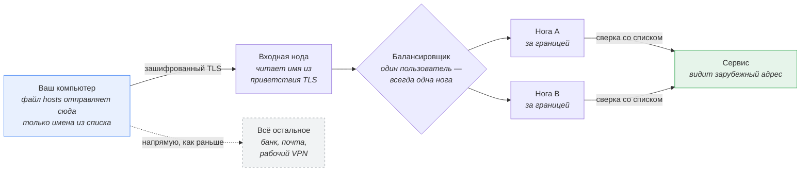
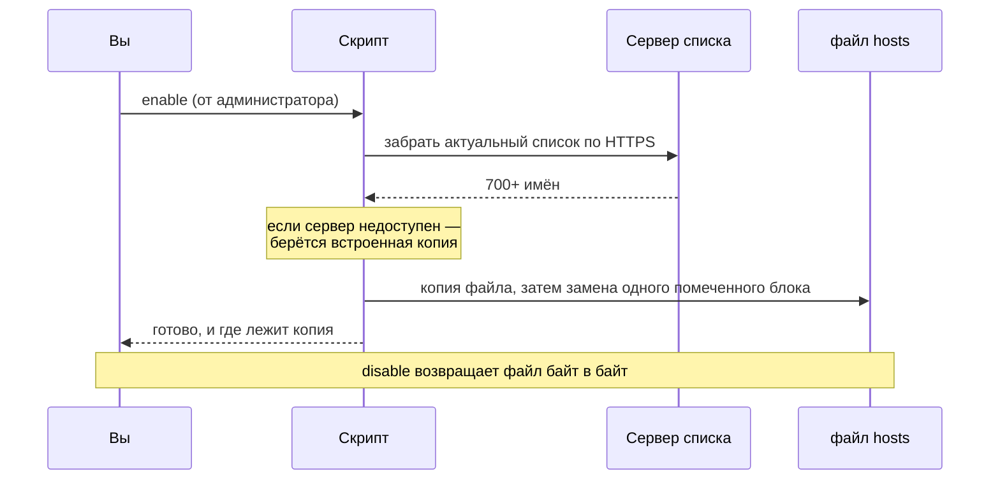

# dns-ai-proxy

[](https://github.com/SteepMans/dns-ai-proxy/stargazers)
[](LICENSE)
[](#установка)

**Если это сэкономило вам вечер — поставьте ⭐, других метрик у проекта нет.**

Доступ к Claude, ChatGPT, Gemini, JetBrains AI и ещё 700+ связанным именам из
страны, которую эти сервисы не обслуживают. Ничего не висит в фоне, системного VPN
нет, расширение для браузера не нужно: скрипт добавляет один блок в файл
`hosts`, и только перечисленные имена идут через прокси за границей.

🇬🇧 [In English](README.md) · 📖 [Ручная настройка](docs/manual.ru.md)

---

## Как это работает



Трафик никто не расшифровывает. Прокси читает только имя сервера, которое TLS
сам передаёт открытым текстом в начале рукопожатия (поле SNI), сверяет его со
списком и пропускает байты дальше нетронутыми. Ни переписку, ни ключи API, ни
аккаунт он увидеть не может — соединение по-прежнему сквозное между вами и
сервисом.

### Что происходит при запуске



Список живёт на сервере, а не внутри клиента: имя, добавленное сегодня,
доедет до вас при следующем запуске — ничего не нужно скачивать заново.

---

## Установка

Скачайте репозиторий ([ZIP](https://github.com/SteepMans/dns-ai-proxy/archive/refs/heads/main.zip)
или `git clone`), откройте папку своей системы и запустите файл.

### Windows

Откройте папку `windows` и запустите двойным щелчком **`enable.bat`**. Права
администратора он запросит сам — Windows покажет обычное окно.

```
windows\enable.bat     включить
windows\disable.bat    выключить
windows\status.bat     посмотреть, что сейчас стоит (права не нужны)
```

### macOS

Откройте папку `macos` и запустите двойным щелчком **`enable.command`**.
Откроется Терминал и спросит пароль от учётной записи: без него `/etc/hosts`
не изменить.

Если macOS отказывается открывать файл («не удаётся открыть, неизвестный
разработчик») — снимите карантинную метку один раз:

```sh
cd macos
xattr -d com.apple.quarantine *.command
chmod +x *.command
```

### Linux

```sh
cd linux
chmod +x *.sh ../bin/dns-ai-proxy.sh
./enable.sh          # спросит sudo
./disable.sh
./status.sh
```

Или напрямую, это то же самое:

```sh
sudo ./bin/dns-ai-proxy.sh enable
```

---

## Что он делает и чего не делает

**Помогает,** когда сервис отвечает «недоступно в вашем регионе», «страна не
поддерживается» или не даёт зарегистрироваться. Это решение самого сервиса по
вашему IP-адресу — прокси даёт ему другой адрес.

**Не помогает,** когда сайт закрыт внутри вашей страны. Фильтр на магистрали
видит в приветствии TLS то же самое имя сервера, которое читает наш прокси, и
видит его первым — задолго до того, как пакеты уйдут за границу. Подмена
адреса не прячет имя. Для таких случаев нужен туннель, который шифрует и само
имя: VPN или, например, Hysteria, но не это.

**Это не VPN.** Через прокси идут только перечисленные имена. Банк, почта,
рабочий VPN и всё остальное ходят ровно как раньше. В этом и смысл: изменение
— один блок в одном файле, и `disable` его убирает.

---

## Что видно нам

Честность важнее красивой строчки, поэтому прямо: трафик перечисленных имён
идёт через серверы автора. Оттуда видно имя сервиса из рукопожатия, ваш
IP-адрес, объём и длительность соединения — те же данные, что уже есть у
вашего провайдера. Содержимое не видно: сессия TLS идёт между вашей машиной и
сервисом, ключей у прокси нет.

Если такой обмен вам не подходит — поднимите свой выходной узел и укажите его
клиенту:

```sh
sudo DNS_AI_PROXY_ENTRY=203.0.113.10 ./bin/dns-ai-proxy.sh enable
```

```powershell
.\bin\dns-ai-proxy.ps1 enable -Entry 203.0.113.10
```

Серверу нужно отвечать на 443-м порту, маршрутизировать по SNI без расшифровки
(nginx `stream` с `ssl_preread` делает это строк в тридцать) и держать свой
список разрешённых имён. Клиенту всё равно, как он устроен.

---

## Список доменов

| | |
|---|---|
| Публикуется | `https://chimney.steep-man.ru/dns-ai-proxy/domains.txt` |
| Группы | ИИ-сервисы, JetBrains |
| Имён | 700+ |
| Копия без сети | [`domains/fallback.txt`](domains/fallback.txt) |

Каждый запуск скачивает актуальный список; встроенная копия идёт в ход, только
если сервер недоступен. Список короче 20 имён считается повреждённым и в
системный файл не попадает.

**Не хватает сервиса?** Заведите issue с именами хостов — серверный список
обновляется отсюда, и они приедут всем при следующем запуске. Чтобы добавить
имена только себе, допишите их в `domains/fallback.txt` и запустите с пустым
`DNS_AI_PROXY_LIST_URL=` — тогда победит локальная копия.

---

## Насколько безопасна сама правка

Скрипт аккуратен с файлом, который правит, потому что файл не его:

- перед каждой правкой делается копия с датой — `hosts.bak-dns-ai-proxy-*`;
- заменяется только текст между двумя метками, больше ничего;
- если блок повреждён (есть начало, нет конца) — скрипт останавливается и не
  меняет ничего;
- новый файл пишется рядом и подменяет старый одним движением, поэтому
  прерванный запуск не оставит систему без `hosts`;
- `disable` возвращает файл байт в байт.

Хотите сделать то же руками или просто посмотреть, что именно пишет скрипт?
В [инструкции по ручной настройке](docs/manual.ru.md) тот же результат разобран
по шагам.

---

## Настройки

| Переменная | По умолчанию | Что это |
|---|---|---|
| `DNS_AI_PROXY_ENTRY` | `84.38.189.217` | Адрес, на который смотрят имена |
| `DNS_AI_PROXY_LIST_URL` | адрес выше | Откуда берётся список |
| `DNS_AI_PROXY_HOSTS` | системный `hosts` | Какой файл править — удобно для проверки |

В Windows те же три есть параметрами: `-Entry`, `-ListUrl`, `-HostsPath`.

---

## Поддержать проект

Выходные узлы — арендованные серверы, трафик оплачивается каждый месяц. Если
вам это пригодилось, стоимость чашки кофе помогает им работать:

| Монета | Адрес |
|---|---|
| BTC | `bc1qfkqmazqmg44uzk286j93f84dzecdarsf7nwxrj` |
| ETH / USDT (ERC-20) | `0xB193C1A2067a911C8df9dB7883C0a2993Ec2c05A` |
| TRX / USDT (TRC-20) | `TSeaXnbc8XVWdXg1RDCEVpqLUvsEakTcnz` |
| USDT (TON) | `UQCWcoMOvwc_2Q9c3bbLHWJA_PJoJK4xzRwK0mvYurGwHC7u` |

⭐ на репозитории не стоит ничего и помогает не меньше.

---

## Лицензия

[MIT](LICENSE). Пользуйтесь, форкайте, поднимайте своё. Без гарантий: вы
правите системный файл на своей машине и пускаете трафик через чужой сервер —
стоит понимать оба этих пункта.
